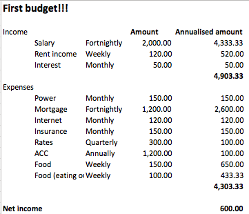

# Creating the outline

This is how we do it!

Once the budget is created

# How to create an outline

1. Have a good think about how to create the budget. What categories
   do you use? What other things do you want to make use of?
2. Create a list of your regular expenses. Put the cost per time you spend it.
   For example, if your rent is weekly, put your weekly amount in. We will
   harmonise all of the expenses later.
3. By later, I mean right now!
   <aside> By the way, this is an aside </aside>

!!! note
    This is another way of doing an aside.

Do we harmonise? 'When we do, we do!'

Here is what your first budget will look like:

